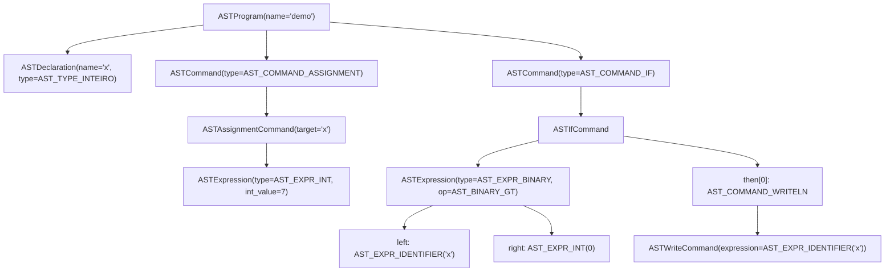

# Aula Técnica: AST real e geração de assembly no compilador SIMPLES

## Objetivo

Este material mostra uma visão mais fiel à implementação do compilador SIMPLES.

Em vez de trabalhar apenas com a ideia geral do pipeline, aqui o foco é:

- a AST real usada pelo projeto
- os tipos e estruturas definidos em `src/ast.h`
- a passagem da AST para trechos reais do assembly gerado

## Programa-base

O estudo de caso desta aula é o arquivo `examples/if_then.simples`:

```simples
programa demo
inteiro x;
inicio
  x <- 7;
  se x > 0 entao
    escreval x;
  fimse
fim
```

Esse exemplo é pequeno, mas já contém os elementos necessários para discutir:

- declaração
- atribuição
- expressão binária relacional
- comando `if`
- comando de escrita

## 1. Mapa das estruturas reais da AST

Para esse programa, as estruturas mais importantes em `src/ast.h` são:

- `ASTProgram`
- `ASTDeclaration`
- `ASTCommand`
- `ASTAssignmentCommand`
- `ASTIfCommand`
- `ASTWriteCommand`
- `ASTExpression`
- `ASTBinaryOp`

Em termos de organização, o compilador representa o programa como:

- um `ASTProgram`
- com uma lista de declarações (`ASTDeclaration`)
- e uma lista de comandos (`ASTCommand`)

Dentro dessa lista de comandos, o nosso exemplo possui:

1. uma atribuição `x <- 7`
2. um comando `if`

Dentro do `if`, a condição `x > 0` é uma expressão binária, e o bloco `then` contém um comando `escreval x`.

## 2. AST real do programa

Usando os nomes reais do projeto, a estrutura central do exemplo pode ser resumida assim:



### Representação textual próxima das structs

```text
ASTProgram {
  name = "demo"
  declarations = [
    ASTDeclaration {
      name = "x"
      type = AST_TYPE_INTEIRO
      storage = AST_STORAGE_SCALAR
    }
  ]
  commands = [
    ASTCommand {
      type = AST_COMMAND_ASSIGNMENT
      assignment = ASTAssignmentCommand {
        target = AST_TARGET_IDENTIFIER("x")
        expression = ASTExpression {
          type = AST_EXPR_INT
          int_value = 7
        }
      }
    },
    ASTCommand {
      type = AST_COMMAND_IF
      if_command = ASTIfCommand {
        condition = ASTExpression {
          type = AST_EXPR_BINARY
          binary.op = AST_BINARY_GT
          binary.left = ASTExpression {
            type = AST_EXPR_IDENTIFIER
            identifier = "x"
          }
          binary.right = ASTExpression {
            type = AST_EXPR_INT
            int_value = 0
          }
        }
        then_commands = [
          ASTCommand {
            type = AST_COMMAND_WRITELN
            write = ASTWriteCommand {
              expression = ASTExpression {
                type = AST_EXPR_IDENTIFIER
                identifier = "x"
              }
            }
          }
        ]
        else_count = 0
      }
    }
  ]
}
```

## 3. Onde essa árvore nasce e é validada

No parser, o trecho `se x > 0 entao ... fimse` é reconhecido como um comando do tipo `AST_COMMAND_IF`.

Nesse processo:

- a condição `x > 0` vira uma `ASTExpression` do tipo `AST_EXPR_BINARY`
- o operador `>` é armazenado como `AST_BINARY_GT`
- os comandos dentro do bloco `then` entram no vetor `then_commands` de `ASTIfCommand`

Em seguida, a análise semântica valida essa estrutura.

Para o nosso exemplo, isso inclui confirmar que:

- `x` foi declarada
- `x <- 7` é uma atribuição válida
- `x > 0` é uma condição aceitável
- `escreval x` usa uma expressão bem tipada

Em outras palavras: o parser organiza a estrutura, e a semântica confirma que essa estrutura faz sentido para o compilador.

