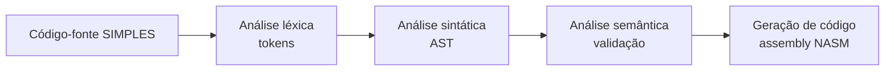

# Aula: Como funciona o processo de compilação no SIMPLES

## Objetivo da aula

- Entender o que significa compilar um programa.
- Visualizar as etapas do compilador SIMPLES.
- Acompanhar um exemplo com `se ... entao` da entrada até o assembly.

## Ideia central

Compilar é transformar um programa escrito em uma linguagem mais próxima do ser humano em uma representação estruturada que possa ser executada pela máquina.

No compilador SIMPLES deste repositório, o processo acontece em quatro fases principais:

1. análise léxica
2. análise sintática
3. análise semântica
4. geração de código

## Visão geral do pipeline



## Exemplo que vamos acompanhar

```simples
programa demo
inteiro x;
inicio
  x <- 7;
  se x > 0 entao
    escreval x;
  fimse
fim
```

Esse programa é pequeno, mas já mostra:

- declaração de variável
- atribuição
- comparação relacional
- estrutura de controle `se ... entao`
- saída com `escreval`
